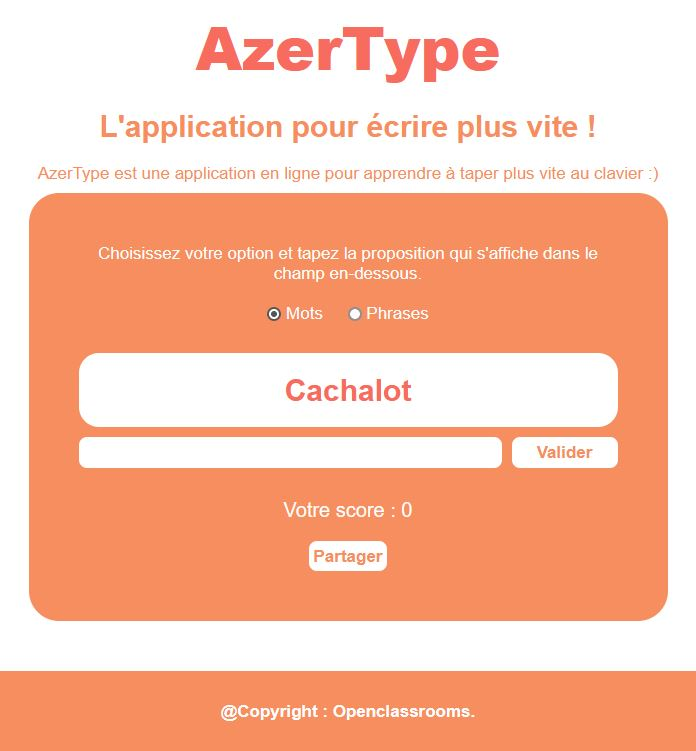

# AzerType - Typing trainer

Application front-end de validation de formulaire.
Codé à partir du [fork d'OpenClassrooms](https://github.com/OpenClassrooms-Student-Center/7696886-javascript) pour le cours ["Apprenez à programmer avec JavaScript"](https://openclassrooms.com/fr/courses/7696886-apprenez-a-programmer-avec-javascript).

[À essayer ici](https://simonribeiro.github.io/AzerType/)
